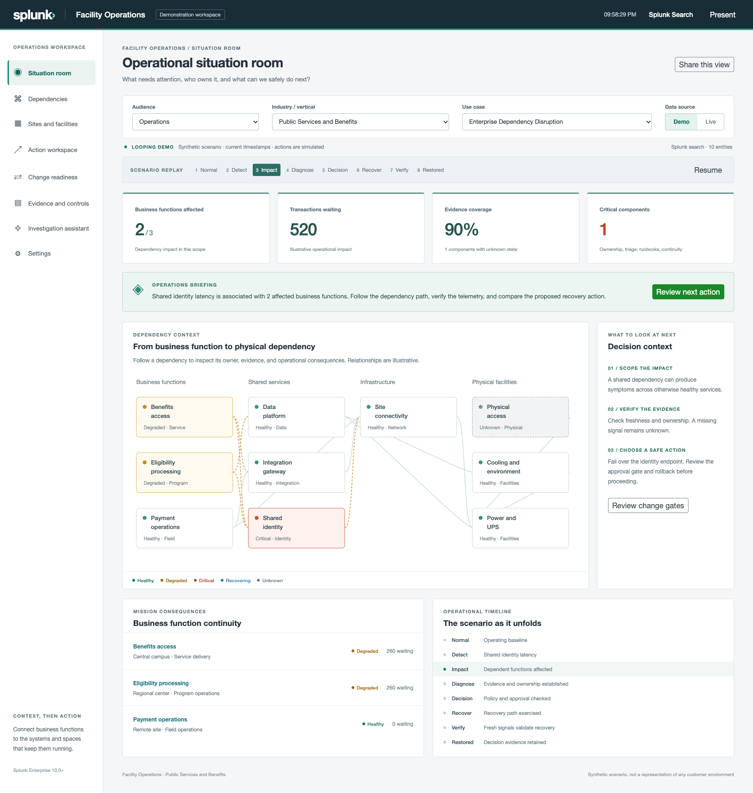

# Facility Operations

Facility Operations connects business functions, shared services, infrastructure, and physical facilities in one Splunk workspace. Presenters can select an audience, vertical, and use case, investigate dependencies, review evidence and decisions, and talk to the operational context.

This is an initial demonstration release. The original Healthcare Operations project is preserved in its separate checkout. Product screens use generic industry and function names; agency research appears only in supporting documentation.



## What is implemented

- Ten audience lenses: Operations, Security, Engineering, Executive, CISO, ISSO, CCB, Facilities, Continuity, and Audit.
- Nine verticals: public services and benefits, enterprise administration, distributed healthcare, regulated science, mission support, oversight, legislative services, global services, and critical infrastructure.
- Six scenarios: enterprise dependency disruption, physical facility continuity, security containment, change risk, modernization, and bounded autonomy.
- Eight workspaces: situation room, interactive dependencies, sites and facilities, action workspace, change readiness, evidence and controls, investigation assistant, and provider settings.
- A recurring synthetic scenario with fresh timestamps, pause and phase selection, responsive navigation, and presentation mode.
- Separate authenticated live searches. Missing and stale telemetry remains unknown; live mode never falls back to synthetic evidence.
- Deterministic investigations for a reliable disconnected demonstration, with event chronology, dependency impact, ownership summaries, draft reports, and JSON/text/SPL downloads.
- Server adapters for Ollama native tools, OpenAI Responses function calling, and Splunk AI Toolkit's `ai` command. Provider credentials stay on the server.

## Run the preview

Requires Node.js 20.19+ and Python 3.9+ for packaging. Install dependencies, build, then serve the exact packaged browser bundle:

```sh
npm ci
npm run package
npm run preview
```

Open http://127.0.0.1:5174. `npm run dev` provides the development preview on port 5173. Standalone previews contain synthetic data only. Configured LLM connections and live searches require installation in Splunk.

## Install in Splunk

Install `artifacts/splunk_facility_operations-0.1.0.spl` through Splunk's app manager. The app ID is `splunk_facility_operations`, and the entry view is `facility_operations`. Open **Facility Operations** in the app menu.

The initial package uses Splunk UI Toolkit components, Enterprise themes, and authenticated Splunk utilities. Its searches use SPL for compatibility with Enterprise 10.0 and 10.4. SPL2 app extensions require a separate version/platform gate; see [architecture](docs/architecture.md). Initial native checks passed on Enterprise 10.0.1 and 10.4.0. See [validation](docs/validation.md) for the tested scope and remaining qualifications.

## Connect real observations

1. Set the app's `facility_ops_live_events` macro in `local/macros.conf` to a bounded, indexed source with the required fields. The default source is `index=facility_ops_live sourcetype=facility_ops:telemetry origin=live`; the package does not create an index or collect telemetry.
2. Populate `lookups/facility_ops_live_inventory.csv` with expected entities, ownership, site, control associations, and semicolon-separated dependencies. Enable each row with `enabled=1` and use a supported vertical ID. Preserve a backup of local inventory across app upgrades.
3. Normalize incoming observations to the [data contract](docs/architecture.md#live-data-contract). Observe the three-minute freshness rule or adapt it to the source's agreed sampling interval.
4. Select **Live**. Permissions are the signed-in user's Splunk permissions. Inventory supplies missing entities so an absent observation is visible as unknown.

## Configure the assistant

In the installed app, open **Settings** as a user with `admin_all_objects`:

- **Ollama:** enter the service origin and a tool-capable model. Loopback refers to the Splunk server. Remote services require HTTPS.
- **OpenAI:** enter the model and API key. The key is saved in Splunk encrypted credential storage; responses are requested with storage disabled.
- **Splunk AI Toolkit:** install and configure the toolkit separately, select its configured provider, and optionally specify a model. This adapter uses `ai` and parses structured tool requests; it does not invoke `aiagent`.
- **Deterministic demo assistant:** requires no model or key and remains useful when a provider is unavailable.

Save settings, then test the saved connection. Sending normalized live evidence to a configured LLM is disabled until an administrator enables it. Questions and bounded recent conversation also reach the selected provider. Provider terms and toolkit permissions still apply.

The assistant executes a small set of read-only tools. It builds constrained searches from validated context and enums, shows tool evidence, and produces downloadable report drafts. It cannot run arbitrary supplied SPL, publish a report, or change infrastructure. Action workspace execution is a clearly marked browser-session simulation.

## Verification and further development

```sh
npm run verify
npm run test:backend
npm run test:browser
```

The browser checks exercise the production bundle. `scripts/verify_lab.py` can verify a selected development instance using an existing credential file; it never prints credentials, restarts Splunk, or modifies other apps. `--install` refuses replacement; `--update` explicitly replaces this candidate app only.

See [customer research](docs/customer-research.md), [presentation guide](docs/demo-guide.md), [architecture and next stages](docs/architecture.md), and [validation](docs/validation.md).
