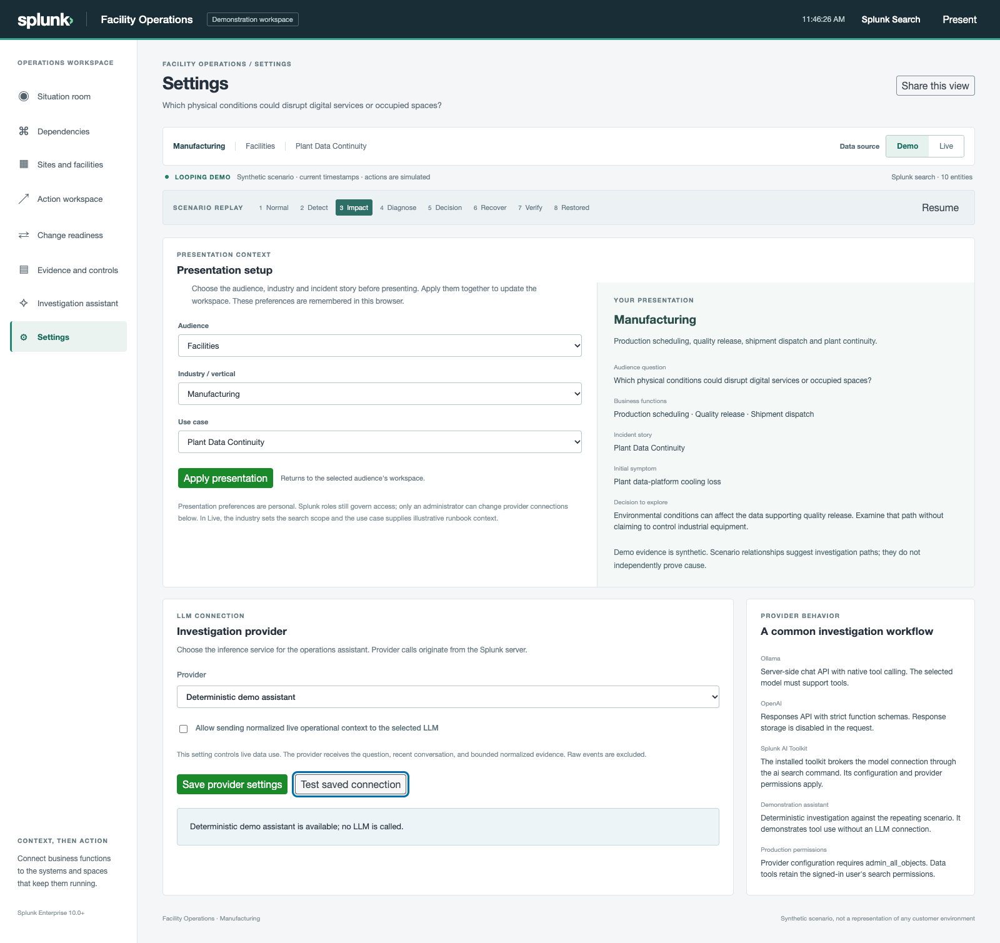

# Commercial operations demonstrations

Facility Operations can now present ordinary commercial business functions alongside the original public sector contexts. The incidents are authored fictional stories; they demonstrate investigation and decision workflows rather than claim industry findings, customer outages or measured losses.

## Set up a clean presentation

Open **Settings → Presentation setup** or the dashboard's **Presentation settings** button. Choose the audience, industry and use case, review the preview, and choose **Apply presentation**. The dashboard shows the active context without selection dropdowns. Demo/Live and replay controls remain available.

The three preferences are remembered in this browser. Valid shared links override them when opened. Provider configuration stays in the separate settings section and still requires administrator access. Presentation choices are available to readers and do not change Splunk permissions.

Enterprise Shared Services is the starting context in a browser without saved preferences or a shared link. Applying an audience returns to its entry workspace: Facilities opens sites, ISSO and Audit open evidence, and Change Control Board opens change readiness. Other audiences open the situation room. Applying context resets action policy and approval; choose supervised or automatic simulation deliberately when needed.

## Choose a business function the audience owns

| Industry / vertical | Business functions | Example dependency story | Sites and owners |
| --- | --- | --- | --- |
| Enterprise Shared Services | Workforce collaboration, finance approvals, employee support | Shared identity disruption affects internal access and work | Headquarters, regional office and branch; workplace, finance and employee-service owners |
| Retail and Commerce | Online checkout, order fulfillment, store operations | Checkout and Fulfillment Access connects customer and fulfillment sign-in latency to shared identity | Commerce hub, distribution center and store; commerce, fulfillment and store owners |
| Manufacturing | Production scheduling, quality release, shipment dispatch | Production and Quality Access narrows the common access path before assuming separate plant failures | Plant, dispatch center and supplier site; planning, quality and logistics owners |
| Logistics and Distribution | Warehouse picking, fleet dispatch, delivery tracking | Warehouse and Dispatch Access follows identity symptoms and shipment work waiting | Hub, distribution center and depot; warehouse, fleet and customer-logistics owners |
| Financial Services | Customer banking, payment processing, fraud review | Banking and Payment Access connects related service symptoms with the shared dependency | Data center, operations center and branch; customer, payment and risk owners |
| Technology and SaaS | Customer sign-in, API service, customer support | Customer Access and API Impact connects sign-in and API symptoms before escalating independent teams | Primary region, secondary region and support hub; reliability, platform and support owners |
| Commercial Properties and Workplace | Tenant services, building operations, workplace access | Tenant and Building Service Access combines digital access, site conditions and responsible owners | Service hub, office building and branch property; tenant, property and workplace owners |
| Hospitality | Guest reservations, property check-in, guest services | Reservation and Check-in Access connects guest-facing symptoms to shared identity | Reservation hub and hotel properties; reservation, property and guest-service owners |

Each of the seven new commercial verticals has six contextual incident stories. The underlying families remain shared dependency, facility continuity, containment, change readiness, modernization and bounded autonomy. Their source IDs and dependency roots remain stable; recovery actions stay within the existing simulation policy.

## Retail: a five-minute incident story

1. In Presentation setup, choose **Retail and Commerce**, **Operations**, and **Checkout and Fulfillment Access**, then apply. Select Demo, Pause and Normal.
2. Choose Impact. Show online checkout and order fulfillment waiting on the identity path, with store operations represented separately. Do not claim that every store or service is affected.
3. Select Shared identity and inspect the sign-in symptom, owner and observation time. Open Investigation assistant and ask for dependency impact.
4. Review chronology, the candidate cause and bounded searches. Explain how current evidence can help clear unrelated candidates and focus the next owner; do not equate a healthy badge with proven innocence.
5. Export the reviewed evidence or report draft. Apply Executive through Settings for the consequence briefing, or Change Control Board for the recovery decision.

## Manufacturing: connect the facility and business consequence

Apply **Manufacturing**, **Facilities**, and **Plant Data Continuity**. Pause at Impact. Sites and facilities should show **Manufacturing plant**, **Dispatch center**, and **Supplier site**. Follow Cooling and environment through the data platform to Quality release.

Apply Engineering to inspect the same dependency and event chronology, or Change Control Board to review the generic workload-transfer simulation, approval and rollback. The demonstration does not control machinery or establish industrial safety, production quality or compliance.

## Technology: discuss change and time to innocence

Apply **Technology and SaaS**, **Engineering**, and **API Data Change Readiness**. Pause at Impact, inspect the data-platform symptom, and ask the assistant for the event sequence and possible cause. Separate the authored change hypothesis from causal proof.

Compare the affected API data path with current customer-access and support observations, then discuss which additional diagnostics a real incident would need. Use [the value worksheet](operations-value.md#plan-a-customer-proof-of-concept) to define time to scope, owner engagement, investigation effort and time to innocence.

## Boundaries for every industry

Orders, shipments, work orders, transactions, requests and bookings are illustrative queue units. They are not forecasts, lost revenue, production output or customer records. Site labels are operational context, not a discovered physical map. Control IDs remain illustrative associations, not sector-specific compliance conclusions.

Commercial stories share the same loop, current timestamps, deterministic investigation, source separation and bounded tools as the public sector stories. All action execution remains simulated. Real sources, dependency authority, model inference, sampling contracts and measured value require their own customer proof of concept.
